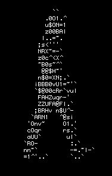

# _*Ascii-art-stylize*_

## _*Description*_

- Ascii-art-stylize is a web application that takes ASCII art to the next level which enhances its visual appeal, interactivity, and user-friendliness.
- The application allows users to input text and select an `ascii-art font`; (shadow, standard, or thinkertoy) to generate an ASCII art banner.

## _*Installation and Setup*_

- To install the project for the use, clone the repository locally using Git:

```bash
git clone https://learn.zone01kisumu.ke/git/jwambugu/ascii-art-stylize.git
```

- Alternatively, download the project directly from Gitea and access it through your file manager.

### _*Usage*_

- To run the application, we will be required to follow the following steps:

- Navigate to the project directory:

```bash
cd ascii-art-stylize
```

- Run the application:

```bash
go run main.go
```

- Open a web browser at the provided port:

```bash
http://localhost:8080
```

## _*Implementation*_

- The application is built upon the previous project Ascii-art-web, incorporating new features and improvements. The enhanced implementation includes:

- _*CSS Integration*_: Enhances visual appearance and interactivity of the site.

- Responsive Design: Adapted layout for various screen sizes and devices.
Accessibility: Ensures text readability regardless of color schemes used.

### _*Algorithm*_

- User sends a `GET` request to the root URL (/) to retrieve the main page.

- Server responds with an HTML template including a text input, radio buttons for banner styles, and a submit button.

- When the form is submitted, the client sends a `POST` request to `/ascii-art` endpoint with text and banner style as form data.

- Server processes the request, generates ASCII art banner using the selected style, and responds with an HTML template displaying the banner.

### _*Code Structure*_

- Let's walk you through the code


shall we...

- The code is organized into the following directories:

  - ascii: contains the ASCII art generation logic.

  - banner: contains resources related to banner styles
  - handlers: contains server endpoint handlers and related logic for HTTP requests and responses.
  - templates: contains HTML templates for main page and ASCII art banner display. It holds the cascading stylesheet as well, for styling the application.

  - HTTP Endpoints
`GET /`: returns the main page HTML template

  - `POST /ascii-art`: processes form data and generates ASCII art banner

### _*HTTP Status Codes*_

- `200 OK`: returned when request is successful

- `404 Not Found`: returned when requested resource is not found

- `400 Bad Request`: returned when request is invalid

- `500 Internal Server Error`: returned when an unhandled error occurs

## _*Notes*_

- The application uses Go templates for displaying data to the user.
- Application uses form data to send text and banner style to the server.
- Application uses HTTP server to handle GET and POST requests.

## _*Authors*_

- [Joan Wambugu](http://github.com/joan2509)

- [Cherrypick14](http://github.com/Cherrypick14)

- [AnxielRay](http://github.com/anxielray)

_-->_ Feel free to make any necessary adjustments or additions based on your specific project requirements!

- Happy coding!

